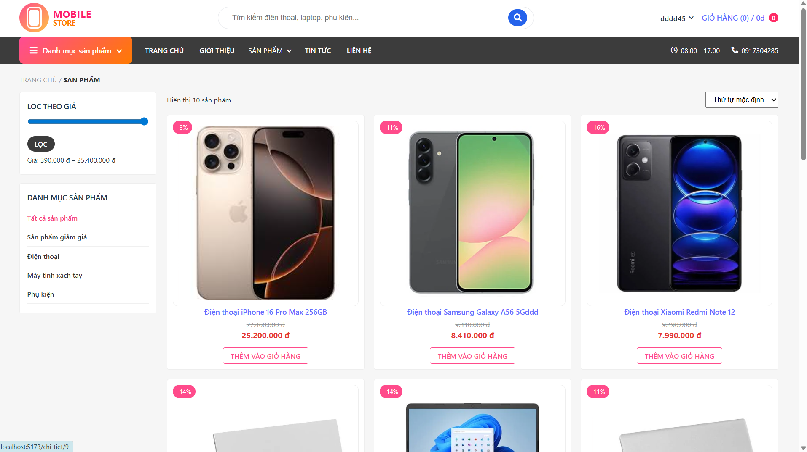
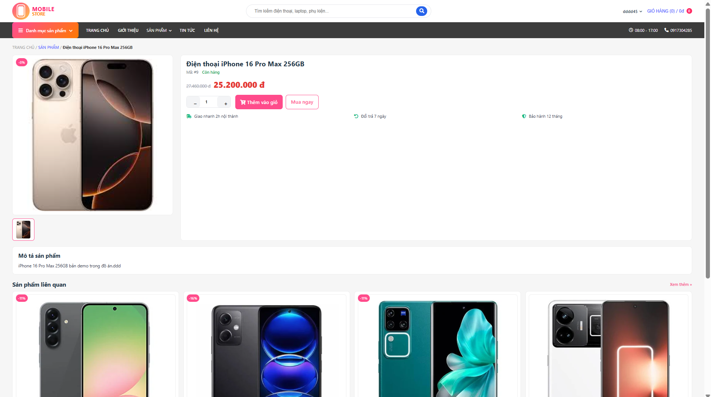
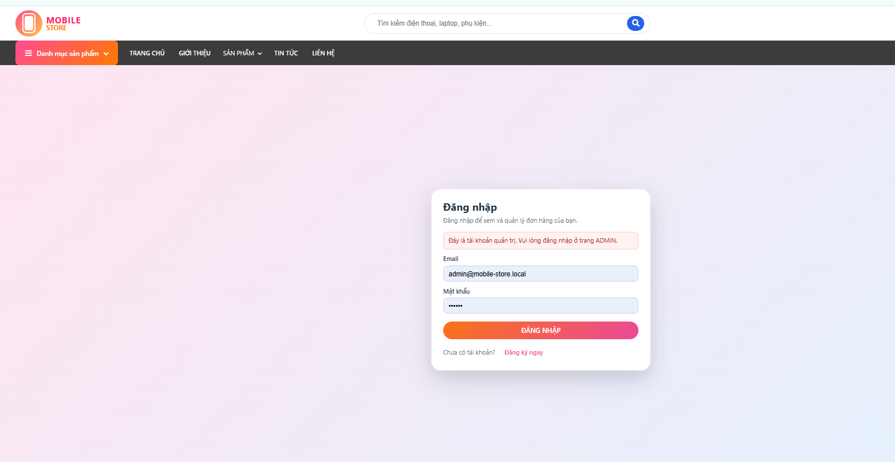
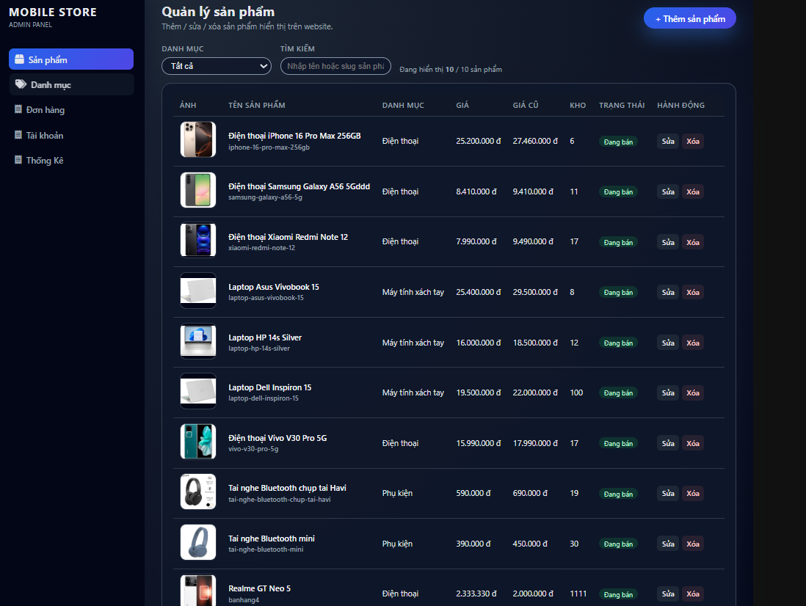

# Đồ án: Website Bán Điện Thoại

## 1. Giới thiệu đề tài

Hệ thống **Website bán điện thoại** cho phép:

- **Khách hàng (User)**:
  - Xem danh sách điện thoại, phụ kiện.
  - Lọc theo hãng, khoảng giá, danh mục, trạng thái khuyến mãi.
  - Xem chi tiết sản phẩm: cấu hình, hình ảnh, giá, khuyến mãi.
  - Thêm sản phẩm vào giỏ hàng, cập nhật số lượng, xóa sản phẩm.
  - Đăng ký / đăng nhập tài khoản người dùng.
  - Đặt hàng và xem lại lịch sử đơn hàng (nếu có).

- **Quản trị viên (Admin)**:
  - Quản lý sản phẩm (thêm, sửa, xóa, ẩn/hiện).
  - Quản lý danh mục sản phẩm.
  - Quản lý khách hàng, đơn hàng.
  - Quản lý khuyến mãi (nếu có).
  - Xem thống kê doanh thu, đơn hàng, sản phẩm bán chạy (nếu đã triển khai).

Kiến trúc hệ thống:

- **Frontend**: React (SPA).
- **Backend**: Node.js + Express (RESTful API).
- **Database**: MySQL / MariaDB.

---

## 2. Công nghệ sử dụng

- **Ngôn ngữ & Framework**
  - Frontend:
    - `React` (Vite)
    - `react-router-dom`
    - `axios`
    - CSS thuần / Tailwind CSS / UI Library khác (nếu có)
  - Backend:
    - `Node.js`
    - `Express.js`
    - `mysql2`
    - `cors`, `dotenv` (nếu có)

- **Cơ sở dữ liệu**
  - `MySQL` / `MariaDB`
  - File export DB: `database/<MaSV>_WebBanDienThoai_DB.sql`

- **Thư viện chính Backend**
  - `express`, `mysql2`, `dotenv`
  - `bcrypt`, `jsonwebtoken`, `multer` (nếu dùng)

- **Thư viện chính Frontend**
  - `react`, `react-router-dom`, `axios`
  - `tailwindcss` / `@mui/material` / `antd` (nếu có)

---

## 3. Cấu trúc thư mục dự án

```text
.
├── backend/
│   ├── src/
│   │   ├── controllers/
│   │   ├── dao/
│   │   ├── middleware/
│   │   ├── routes/
│   │   ├── config/ hoặc db.js
│   │   └── app.js / server.js
│   ├── package.json
│   └── ...
│
├── frontend/
│   ├── src/
│   │   ├── pages/
│   │   ├── components/
│   │   ├── api/
│   │   ├── context/
│   │   ├── utils/
│   │   └── main.jsx / App.jsx
│   ├── public/
│   ├── package.json
│   └── ...
│
├── database/
│   └── <MaSV>_WebBanDienThoai_DB.sql
│
├── docs/
│   └── images/
│       ├── home.png
│       ├── product-detail.png
│       ├── cart.png
│       ├── login.png
│       └── admin-dashboard.png
│
├── .gitignore
└── README.md
```

---

## 4. Yêu cầu môi trường

Để chạy được hệ thống, máy cần cài đặt:

- **Node.js**: v18.x LTS (khuyến nghị)
- **npm**: ≥ 8.x
- **MySQL / MariaDB**
- **Git**

> Nếu chạy frontend bằng Vite: port mặc định `5173`, tránh trùng port.

---

## 5. Hướng dẫn cài đặt & chạy chương trình

### 5.1. Clone source code

```bash
git clone https://github.com/Canhettg1133/web-ban-dien-thoai.git
cd web-ban-dien-thoai
```

### 5.2. Import database

**Cách 1: phpMyAdmin**

1. Mở XAMPP → Start MySQL.  
2. Vào: `http://localhost/phpmyadmin`  
3. Tạo database:

```sql
CREATE DATABASE Quan_Ly_Kho_Hang
CHARACTER SET utf8mb4
COLLATE utf8mb4_unicode_ci;
```

4. Chọn database `Quan_Ly_Kho_Hang` → tab **Import**  
5. Chọn file: `database/<MaSV>_WebBanDienThoai_DB.sql`  
6. Bấm **Go**.

**Cách 2: MySQL CLI**

```bash
mysql -u root -p Quan_Ly_Kho_Hang < database/<MaSV>_WebBanDienThoai_DB.sql
```

### 5.3. Tạo file `.env` cho backend

Trong thư mục `backend/`, tạo file `.env`:

```env
DB_HOST=localhost
DB_PORT=3306
DB_USER=root
DB_PASSWORD=123456
DB_NAME=Quan_Ly_Kho_Hang

PORT=3001
JWT_SECRET=ban_dien_thoai_2025
```

### 5.4. Chạy Backend

```bash
cd backend
npm install
npm run dev
```

Backend chạy tại: `http://localhost:3001`

### 5.5. Chạy Frontend

```bash
cd ../frontend
npm install
npm run dev
```

Frontend chạy tại: `http://localhost:5173`

**Nếu dùng Vite env**, tạo file `frontend/.env`:

```env
VITE_API_BASE=http://localhost:3001/api
```

---

## 6. Tài khoản demo

⚠️ Hãy sửa lại đúng theo dữ liệu thật trong database của bạn.

Ví dụ:

| Vai trò | Tài khoản  | Mật khẩu |
|--------|------------|----------|
| Admin  | admin33333 | 123456   |
| User   | user1      | 123456   |

---

## 7. Kết quả & hình ảnh minh họa

Một số giao diện chính của hệ thống:

- Trang chủ: danh sách điện thoại, banner khuyến mãi.
- Trang chi tiết sản phẩm.
- Trang giỏ hàng & đặt hàng.
- Trang đăng nhập / đăng ký.
- Trang quản trị (Admin).

### 7.1. Trang chủ


### 7.2. Trang chi tiết sản phẩm


### 7.3. Trang giỏ hàng


### 7.4. Trang đăng nhập


### 7.5. Trang quản trị (Admin)

